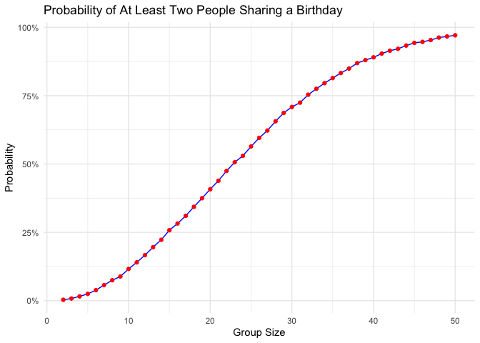
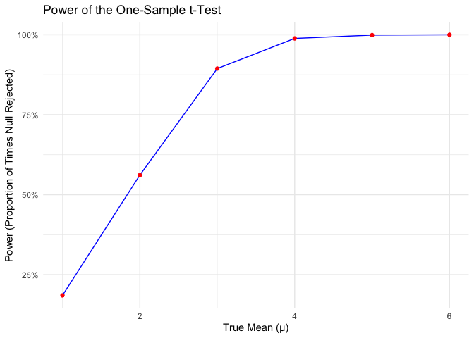
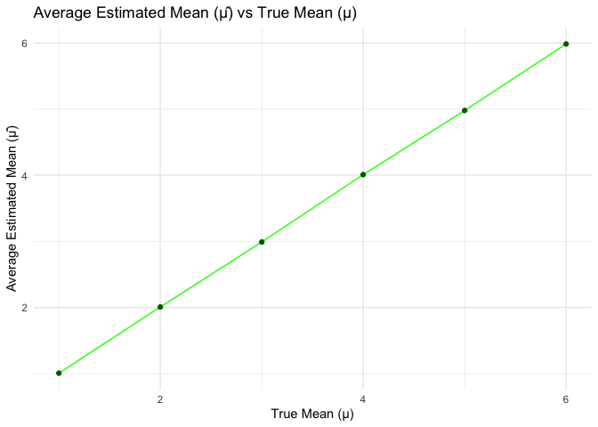
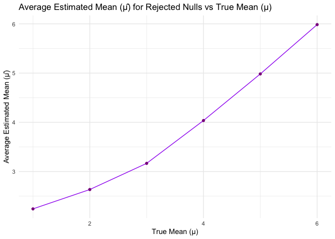
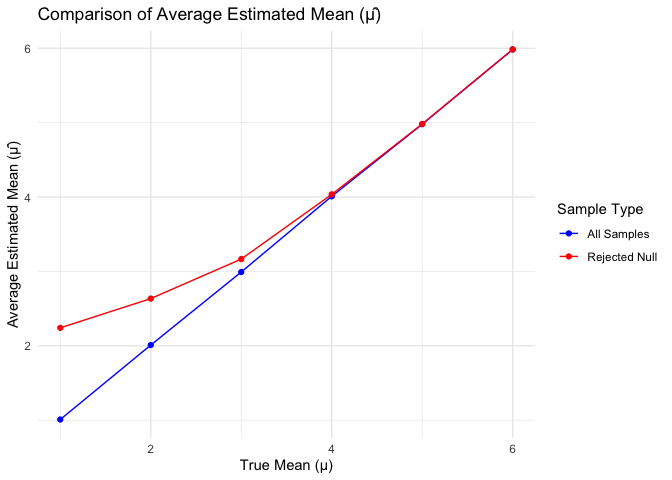
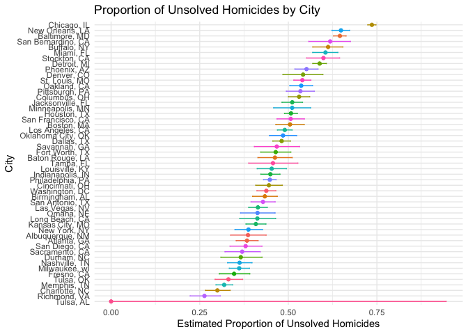

p8105_hw4_CY2772
================
Chenhui Yan
2024-11-14

``` r
library(tidyverse)
```

    ## ── Attaching core tidyverse packages ──────────────────────── tidyverse 2.0.0 ──
    ## ✔ dplyr     1.1.4     ✔ readr     2.1.5
    ## ✔ forcats   1.0.0     ✔ stringr   1.5.1
    ## ✔ ggplot2   3.5.1     ✔ tibble    3.2.1
    ## ✔ lubridate 1.9.3     ✔ tidyr     1.3.1
    ## ✔ purrr     1.0.2     
    ## ── Conflicts ────────────────────────────────────────── tidyverse_conflicts() ──
    ## ✖ dplyr::filter() masks stats::filter()
    ## ✖ dplyr::lag()    masks stats::lag()
    ## ℹ Use the conflicted package (<http://conflicted.r-lib.org/>) to force all conflicts to become errors

``` r
library(broom)
library(purrr)
library(knitr)
library(ggplot2)
```

# Problem 1: Birthday problem

``` r
# Create the simulation function
simulate_birthday = function(n) {
  birthdays <- sample(1:365, size = n, replace = TRUE)
  any(duplicated(birthdays))
}
```

``` r
# Run the simulation for each group size
set.seed(123)  # For reproducibility

group_sizes = 2:50
num_simulations = 10000

probabilities = sapply(group_sizes, function(n) {
  results = replicate(num_simulations, simulate_birthday(n))
  mean(results)
})
```

``` r
# Plot the probabilities

plot_data = data.frame(
  group_size = group_sizes,
  probability = probabilities
)

ggplot(plot_data, aes(x = group_size, y = probability)) +
  geom_line(color = "blue") +
  geom_point(color = "red") +
  labs(
    title = "Probability of At Least Two People Sharing a Birthday",
    x = "Group Size",
    y = "Probability"
  ) +
  theme_minimal() +
  scale_y_continuous(labels = scales::percent_format(accuracy = 1))
```

<!-- -->

The plot shows a sigmoid-like curve, starting very low for small groups
and then rapidly increasing around group sizes of 20-30, and then
leveling off near 1 (100%) for group sizes approaching 50.

# Problem 2:

``` r
#Simulating the Data and Performing the Tests
set.seed(123)  # for reproducibility

n = 30
sigma = 5
mu_values = 1:6
num_simulations = 5000

results = data.frame()

for (mu in mu_values) {
  for (i in 1:num_simulations) {
    # Generate a dataset from N(mu, sigma^2)
    x = rnorm(n, mean = mu, sd = sigma)
    
    # Perform a one-sample t-test
    test_result = t.test(x, mu = 0)
    tidy_result = tidy(test_result)
    
    # Store the estimated mean and p-value
    results = rbind(results, data.frame(
      true_mu = mu,
      estimate = mean(x),
      p_value = tidy_result$p.value
    ))
  }
}
```

``` r
#Calculating Power and Summarizing Results
summary_results = results %>%
  group_by(true_mu) %>%
  summarize(
    power = mean(p_value < 0.05),
    avg_estimate = mean(estimate),
    avg_estimate_rejected = mean(estimate[p_value < 0.05], na.rm = TRUE)
  )
  
summary_results
```

    ## # A tibble: 6 × 4
    ##   true_mu power avg_estimate avg_estimate_rejected
    ##     <int> <dbl>        <dbl>                 <dbl>
    ## 1       1 0.185         1.01                  2.24
    ## 2       2 0.561         2.01                  2.63
    ## 3       3 0.894         2.99                  3.17
    ## 4       4 0.989         4.01                  4.04
    ## 5       5 0.999         4.98                  4.98
    ## 6       6 1             5.98                  5.98

``` r
#Visualization and Interpretation
#a): Plotting the Power of the Test
ggplot(summary_results, aes(x = true_mu, y = power)) +
  geom_line(color = "blue") +
  geom_point(color = "red") +
  labs(
    title = "Power of the One-Sample t-Test",
    x = "True Mean (µ)",
    y = "Power (Proportion of Times Null Rejected)"
  ) +
  theme_minimal() +
  scale_y_continuous(labels = scales::percent_format(accuracy = 1))
```

<!-- -->

When the true mean diverges further from the null hypothesis value of
zero, the test’s power increases correspondingly. This means that as the
effect size grows, the likelihood of correctly rejecting the null
hypothesis also rises.

``` r
#(b) Plotting the Average Estimates
# Average estimate across all samples
plot_avg_estimate = ggplot(summary_results, aes(x = true_mu, y = avg_estimate)) +
  geom_line(color = "green") +
  geom_point(color = "darkgreen") +
  labs(
    title = "Average Estimated Mean (µ̂) vs True Mean (µ)",
    x = "True Mean (µ)",
    y = "Average Estimated Mean (µ̂)"
  ) +
  theme_minimal()

# Average estimate only where null was rejected
plot_avg_estimate_rejected = ggplot(summary_results, aes(x = true_mu, y = avg_estimate_rejected)) +
  geom_line(color = "purple") +
  geom_point(color = "darkmagenta") +
  labs(
    title = "Average Estimated Mean (µ̂) for Rejected Nulls vs True Mean (µ)",
    x = "True Mean (µ)",
    y = "Average Estimated Mean (µ̂)"
  ) +
  theme_minimal()

plot_avg_estimate
```

<!-- -->

``` r
plot_avg_estimate_rejected
```

<!-- -->

``` r
ggplot(summary_results, aes(x = true_mu)) +
  geom_line(aes(y = avg_estimate, color = "All Samples")) +
  geom_point(aes(y = avg_estimate, color = "All Samples")) +
  geom_line(aes(y = avg_estimate_rejected, color = "Rejected Null")) +
  geom_point(aes(y = avg_estimate_rejected, color = "Rejected Null")) +
  scale_color_manual(values = c("All Samples" = "blue", "Rejected Null" = "red")) +
  labs(
    title = "Comparison of Average Estimated Mean (µ̂)",
    x = "True Mean (µ)",
    y = "Average Estimated Mean (µ̂)",
    color = "Sample Type"
  ) +
  theme_minimal()
```

<!-- -->
When considering all samples, the average estimated mean $\hat{\mu}$
closely reflects the true mean value. However, if we examine only the
samples where the null hypothesis was rejected, the average estimate
tends to be higher than the true mean, particularly when the true mean
is small. This happens due to selection bias, as only those samples that
show larger deviations from the null hypothesis are included in this
subset.

# Problem3

## Load and describe the raw data

``` r
homicides = read_csv("./homicide-data.csv")|>
  janitor::clean_names()
```

    ## Rows: 52179 Columns: 12
    ## ── Column specification ────────────────────────────────────────────────────────
    ## Delimiter: ","
    ## chr (9): uid, victim_last, victim_first, victim_race, victim_age, victim_sex...
    ## dbl (3): reported_date, lat, lon
    ## 
    ## ℹ Use `spec()` to retrieve the full column specification for this data.
    ## ℹ Specify the column types or set `show_col_types = FALSE` to quiet this message.

``` r
summary(homicides)
```

    ##      uid            reported_date       victim_last        victim_first      
    ##  Length:52179       Min.   : 20070101   Length:52179       Length:52179      
    ##  Class :character   1st Qu.: 20100318   Class :character   Class :character  
    ##  Mode  :character   Median : 20121216   Mode  :character   Mode  :character  
    ##                     Mean   : 20130899                                        
    ##                     3rd Qu.: 20150911                                        
    ##                     Max.   :201511105                                        
    ##                                                                              
    ##  victim_race         victim_age         victim_sex            city          
    ##  Length:52179       Length:52179       Length:52179       Length:52179      
    ##  Class :character   Class :character   Class :character   Class :character  
    ##  Mode  :character   Mode  :character   Mode  :character   Mode  :character  
    ##                                                                             
    ##                                                                             
    ##                                                                             
    ##                                                                             
    ##     state                lat             lon          disposition       
    ##  Length:52179       Min.   :25.73   Min.   :-122.51   Length:52179      
    ##  Class :character   1st Qu.:33.77   1st Qu.: -96.00   Class :character  
    ##  Mode  :character   Median :38.52   Median : -87.71   Mode  :character  
    ##                     Mean   :37.03   Mean   : -91.47                     
    ##                     3rd Qu.:40.03   3rd Qu.: -81.76                     
    ##                     Max.   :45.05   Max.   : -71.01                     
    ##                     NA's   :60      NA's   :60

## create city_state variable and summarise

``` r
# Create a new 'city_state' variable by combining 'city' and 'state'
homicides = homicides %>% 
  mutate(city_state = paste(city, state, sep = ", "))

# Summarize the total and unsolved homicides by 'city_state'
summ_homicides = homicides %>% 
  group_by(city_state) %>% 
  summarize(
    total_homicides = n(),
    unsolved_homicides = sum(disposition %in% c("Closed without arrest", "Open/No arrest"))
  )

# Display the summarized data in a nicely formatted table
summ_homicides %>%  knitr::kable()
```

| city_state         | total_homicides | unsolved_homicides |
|:-------------------|----------------:|-------------------:|
| Albuquerque, NM    |             378 |                146 |
| Atlanta, GA        |             973 |                373 |
| Baltimore, MD      |            2827 |               1825 |
| Baton Rouge, LA    |             424 |                196 |
| Birmingham, AL     |             800 |                347 |
| Boston, MA         |             614 |                310 |
| Buffalo, NY        |             521 |                319 |
| Charlotte, NC      |             687 |                206 |
| Chicago, IL        |            5535 |               4073 |
| Cincinnati, OH     |             694 |                309 |
| Columbus, OH       |            1084 |                575 |
| Dallas, TX         |            1567 |                754 |
| Denver, CO         |             312 |                169 |
| Detroit, MI        |            2519 |               1482 |
| Durham, NC         |             276 |                101 |
| Fort Worth, TX     |             549 |                255 |
| Fresno, CA         |             487 |                169 |
| Houston, TX        |            2942 |               1493 |
| Indianapolis, IN   |            1322 |                594 |
| Jacksonville, FL   |            1168 |                597 |
| Kansas City, MO    |            1190 |                486 |
| Las Vegas, NV      |            1381 |                572 |
| Long Beach, CA     |             378 |                156 |
| Los Angeles, CA    |            2257 |               1106 |
| Louisville, KY     |             576 |                261 |
| Memphis, TN        |            1514 |                483 |
| Miami, FL          |             744 |                450 |
| Milwaukee, wI      |            1115 |                403 |
| Minneapolis, MN    |             366 |                187 |
| Nashville, TN      |             767 |                278 |
| New Orleans, LA    |            1434 |                930 |
| New York, NY       |             627 |                243 |
| Oakland, CA        |             947 |                508 |
| Oklahoma City, OK  |             672 |                326 |
| Omaha, NE          |             409 |                169 |
| Philadelphia, PA   |            3037 |               1360 |
| Phoenix, AZ        |             914 |                504 |
| Pittsburgh, PA     |             631 |                337 |
| Richmond, VA       |             429 |                113 |
| Sacramento, CA     |             376 |                139 |
| San Antonio, TX    |             833 |                357 |
| San Bernardino, CA |             275 |                170 |
| San Diego, CA      |             461 |                175 |
| San Francisco, CA  |             663 |                336 |
| Savannah, GA       |             246 |                115 |
| St. Louis, MO      |            1677 |                905 |
| Stockton, CA       |             444 |                266 |
| Tampa, FL          |             208 |                 95 |
| Tulsa, AL          |               1 |                  0 |
| Tulsa, OK          |             583 |                193 |
| Washington, DC     |            1345 |                589 |

``` r
# Use dplyr's filter function to get data for Baltimore, MD
baltimore_data = summ_homicides %>%
  filter(city_state == "Baltimore, MD") %>%
  select(unsolved_homicides, total_homicides)

unsolved_cases = baltimore_data$unsolved_homicides
total_cases = baltimore_data$total_homicides

# Perform the proportion test
baltimore_prop_test = prop.test(
  x = unsolved_cases,
  n = total_cases
)


baltimore_results = baltimore_prop_test %>%
  tidy() %>%
  select(estimate, conf.low, conf.high)

# Display the results
print(baltimore_results)
```

    ## # A tibble: 1 × 3
    ##   estimate conf.low conf.high
    ##      <dbl>    <dbl>     <dbl>
    ## 1    0.646    0.628     0.663

``` r
# Perform proportion tests for all cities
city_proportions = summ_homicides %>%
  mutate(
    # Apply prop.test to unsolved and total homicides for each city
    prop_test = map2(
      unsolved_homicides,
      total_homicides,
      ~ prop.test(x = .x, n = .y) %>% tidy()
    )
  ) %>%
  unnest(prop_test) %>%
  select(
    city_state,
    estimated_proportion = estimate,
    conf_low = conf.low,
    conf_high = conf.high
  )
```

    ## Warning: There was 1 warning in `mutate()`.
    ## ℹ In argument: `prop_test = map2(...)`.
    ## Caused by warning in `prop.test()`:
    ## ! Chi-squared approximation may be incorrect

``` r
# Display the estimated proportions and confidence intervals in a table
city_proportions %>%
  kable(
    col.names = c("City, State", "Estimated Proportion", "CI Lower", "CI Upper"),
    caption = "Proportion of Unsolved Homicides by City",
    digits = 3,
    format = "markdown"
  )
```

| City, State        | Estimated Proportion | CI Lower | CI Upper |
|:-------------------|---------------------:|---------:|---------:|
| Albuquerque, NM    |                0.386 |    0.337 |    0.438 |
| Atlanta, GA        |                0.383 |    0.353 |    0.415 |
| Baltimore, MD      |                0.646 |    0.628 |    0.663 |
| Baton Rouge, LA    |                0.462 |    0.414 |    0.511 |
| Birmingham, AL     |                0.434 |    0.399 |    0.469 |
| Boston, MA         |                0.505 |    0.465 |    0.545 |
| Buffalo, NY        |                0.612 |    0.569 |    0.654 |
| Charlotte, NC      |                0.300 |    0.266 |    0.336 |
| Chicago, IL        |                0.736 |    0.724 |    0.747 |
| Cincinnati, OH     |                0.445 |    0.408 |    0.483 |
| Columbus, OH       |                0.530 |    0.500 |    0.560 |
| Dallas, TX         |                0.481 |    0.456 |    0.506 |
| Denver, CO         |                0.542 |    0.485 |    0.598 |
| Detroit, MI        |                0.588 |    0.569 |    0.608 |
| Durham, NC         |                0.366 |    0.310 |    0.426 |
| Fort Worth, TX     |                0.464 |    0.422 |    0.507 |
| Fresno, CA         |                0.347 |    0.305 |    0.391 |
| Houston, TX        |                0.507 |    0.489 |    0.526 |
| Indianapolis, IN   |                0.449 |    0.422 |    0.477 |
| Jacksonville, FL   |                0.511 |    0.482 |    0.540 |
| Kansas City, MO    |                0.408 |    0.380 |    0.437 |
| Las Vegas, NV      |                0.414 |    0.388 |    0.441 |
| Long Beach, CA     |                0.413 |    0.363 |    0.464 |
| Los Angeles, CA    |                0.490 |    0.469 |    0.511 |
| Louisville, KY     |                0.453 |    0.412 |    0.495 |
| Memphis, TN        |                0.319 |    0.296 |    0.343 |
| Miami, FL          |                0.605 |    0.569 |    0.640 |
| Milwaukee, wI      |                0.361 |    0.333 |    0.391 |
| Minneapolis, MN    |                0.511 |    0.459 |    0.563 |
| Nashville, TN      |                0.362 |    0.329 |    0.398 |
| New Orleans, LA    |                0.649 |    0.623 |    0.673 |
| New York, NY       |                0.388 |    0.349 |    0.427 |
| Oakland, CA        |                0.536 |    0.504 |    0.569 |
| Oklahoma City, OK  |                0.485 |    0.447 |    0.524 |
| Omaha, NE          |                0.413 |    0.365 |    0.463 |
| Philadelphia, PA   |                0.448 |    0.430 |    0.466 |
| Phoenix, AZ        |                0.551 |    0.518 |    0.584 |
| Pittsburgh, PA     |                0.534 |    0.494 |    0.573 |
| Richmond, VA       |                0.263 |    0.223 |    0.308 |
| Sacramento, CA     |                0.370 |    0.321 |    0.421 |
| San Antonio, TX    |                0.429 |    0.395 |    0.463 |
| San Bernardino, CA |                0.618 |    0.558 |    0.675 |
| San Diego, CA      |                0.380 |    0.335 |    0.426 |
| San Francisco, CA  |                0.507 |    0.468 |    0.545 |
| Savannah, GA       |                0.467 |    0.404 |    0.532 |
| St. Louis, MO      |                0.540 |    0.515 |    0.564 |
| Stockton, CA       |                0.599 |    0.552 |    0.645 |
| Tampa, FL          |                0.457 |    0.388 |    0.527 |
| Tulsa, AL          |                0.000 |    0.000 |    0.945 |
| Tulsa, OK          |                0.331 |    0.293 |    0.371 |
| Washington, DC     |                0.438 |    0.411 |    0.465 |

Proportion of Unsolved Homicides by City

``` r
ggplot(city_proportions, aes(x = reorder(city_state, estimated_proportion), y = estimated_proportion, color = city_state)) +
  geom_point() +
  geom_errorbar(aes(ymin = conf_low, ymax = conf_high), width = 0.2) +
  coord_flip() +
  labs(
    title = "Proportion of Unsolved Homicides by City",
    x = "City",
    y = "Estimated Proportion of Unsolved Homicides"
  ) +
  theme_minimal() +
  theme(legend.position = 'none')
```

<!-- -->
